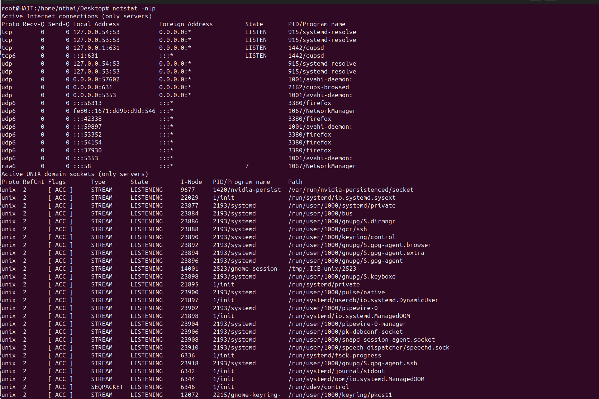
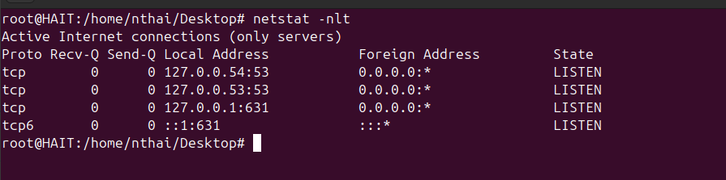
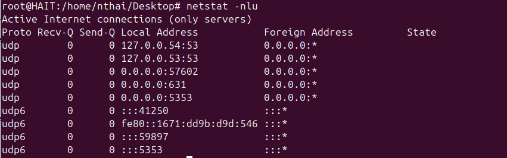
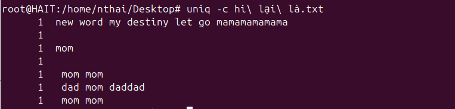
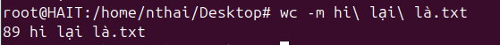

Command Line: 
Bài tập: Thực hành từng command và note lại quá trình chạy command đó. Vào file markdown và lưu tại: <name>/linux/linux-basic/commandLine.md

telnet command : là công cụ dòng lệnh dùng để kiểm tra và xử lý các kết nối mạng.
Sử dụng để kiểm tra và kết nối đến các dịch vụ mạng TCP đơn giản như HTTP, SMTP, FTP, v.v.

telnet [hostname or IP] [port]

nc command: Kết nối từ xa, kiểm tra dịch vụ, chuyển tiếp cổng, quét cổng, truyền tệp

nc [options] [hostname or IP] [port]

telnet đến port 22 của ip vps lab trả lời port có mở hay không

telnet đến port 20 của ip vps lab trả lời port có mở hay không

ping/hping3 ping đến domain zonecloud.vn sau đó giải thích

Ping zonecloud.vn

![alt text][def16]

Kích thước gói tin: 64 bytes. Đây là kích thước của gói tin ICMP 

Địa chỉ IP và hostname của máy chủ phản hồi: 103.130.216.89 (static-89-216-130-103.tino.vn).

Số thứ tự gói tin: 1.

TTL của gói tin phản hồi: 56.

Thời gian hồi đáp từ máy chủ : 5.85 ms.
hping3 :   

hping3 -S zonecloud.vn -p 80

-S: Gửi gói SYN (SYN flag set).

zonecloud.vn: Tên miền hoặc địa chỉ IP của mục tiêu.

-p 80: Cổng đích là 80 (HTTP).

![alt text][def15]

len=44: Chiều dài của gói tin là 44 bytes.

ip=103.130.216.89: Địa chỉ IP của máy chủ phản hồi.

ttl=52: Time to Live của gói tin phản hồi.

id=0: Identifier của gói tin.

sport=0: Cổng nguồn là 0 (do cổng đích mặc định là 0).

flags=RA: Các cờ trong gói tin phản hồi là RST-ACK (Reset and Acknowledge). Điều này thường xảy ra khi cổng đích không mở hoặc không có dịch vụ nào lắng nghe trên cổng đó.
seq=0, 1, 2: Số thứ tự của các gói tin.

win=0: Kích thước cửa sổ TCP là 0.

rtt=49.9 ms, 50.1 ms, 50.2 ms: Round-trip time - thời gian hồi đáp của các gói tin, tính 
bằng milliseconds (ms).

ttl= là gì?

Time to Live (TTL) là giá trị cho biết số lượng bước nhảy (hops) mà gói tin có thể đi qua trước khi bị loại bỏ. Mỗi khi gói tin đi qua một router, giá trị TTL sẽ giảm đi một đơn vị. Nếu TTL giảm về 0, gói tin sẽ bị loại bỏ. TTL có thể cung cấp thông tin về số lượng router mà gói tin đã đi qua từ máy gửi đến máy nhận.

time= là gì? 

Đây là thời gian hồi đáp (round-trip time) của gói tin, tính bằng milliseconds (ms). Thời gian này đo lường khoảng thời gian từ khi gói tin được gửi đi cho đến khi nhận được phản hồi từ máy chủ. 
vd:         Giá trị thấp (như 5.85 ms) cho thấy kết nối mạng giữa máy của bạn và máy chủ zonecloud.vn rất nhanh và ổn định.

ssh command

Dùng password: Khóa SSH cung cấp một cách an toàn hơn để kết nối với máy chủ so với mật khẩu. Để sử dụng khóa SSH, trước tiên bạn cần tạo một cặp khóa SSH và thêm khóa công khai vào máy chủ từ xa.

ssh username@remote_host

Dùng key: 

ssh-keygen -t rsa -b 4096 -C "your_email@example.com"

ssh -i /path/to/private_key username@remote_host

ssh-copy-id username@remote_host

Dùng port custom

ssh -p port_number username@remote_host

ssh -i /path/to/private_key -p port_number username@remote_host

scp command : Lệnh scp (Secure Copy) được sử dụng để sao chép các tệp tin và thư mục giữa các máy tính từ xa một cách an toàn qua mạng. Dưới đây là cách sử dụng scp để sao chép một tệp tin và một thư mục.

scp 1 file : 

Từ máy - máy từ xa : scp /path/to/local/file username@remote_host:/path/to/remote/destination

Từ máy từ xa - máy  :scp username@remote_host:/path/to/remote/file /path/to/local/destination

scp 1 folder: 

Từ máy - máy từ xa : scp -r /path/to/local/folder username@remote_host:/path/to/remote/destination

Từ máy từ xa - máy : scp -r username@remote_host:/path/to/remote/folder /path/to/local/destination

 Nếu là port khác : 
scp -P port_number /path/to/local/file username@remote_host:/path/to/remote/destination

rsync command : 
Lệnh rsync được sử dụng để đồng bộ hóa và sao chép tệp tin và thư mục giữa các máy tính từ xa hoặc trong cùng một hệ thống. rsync có khả năng đồng bộ hóa chỉ những phần thay đổi, giúp tiết kiệm băng thông và thời gian. Dưới đây là cách sử dụng rsync để sao chép tệp tin, thư mục, và thực hiện đồng bộ hóa gia tăng (incremental synchronization).

rsync file : 
Từ máy - máy từ xa: rsync -avz /path/to/local/file username@remote_host:/path/to/remote/destination

Từ máy từ xa - máy:rsync -avz username@remote_host:/path/to/remote/file /path/to/local/destination

rsync folder : 
Từ máy - máy từ xa:rsync -avz /path/to/local/folder username@remote_host:/path/to/remote/destination

Từ máy từ xa - máy:rsync -avz username@remote_host:/path/to/remote/folder /path/to/local/destination

rsync increamental : tự động thực hiện đồng bộ hóa gia tăng, nghĩa là nó chỉ sao chép các tệp tin đã thay đổi hoặc mới. Cú pháp sử dụng vẫn như các ví dụ trên. 

Các tùy chọn thường dùng:

    -a : Archive mode, đồng bộ hóa toàn bộ thư mục và giữ nguyên thuộc tính của tệp tin.
    -v : Verbose, hiển thị thông tin chi tiết quá trình sao chép.
    -z : Compress, nén dữ liệu trong quá trình truyền để tiết kiệm băng thông.
    --delete : Xóa các tệp tin ở đích mà không còn tồn tại ở nguồn, giúp đồng bộ hóa hoàn toàn.

rsync -avz --delete /path/to/local/folder username@remote_host:/path/to/remote/destination

rsync -avz -e "ssh -p port_number" /path/to/local/file_or_folder username@remote_host:/path/to/remote/destination

cat command: Lệnh cat (concatenate) trong Linux được sử dụng để hiển thị nội dung của tệp tin, kết hợp nhiều tệp tin và chuyển nội dung vào tệp tin khác.

cat nội dung 1 file 

cat /path/to/file

![alt text][def14]

cat dòng thứ <n> trong file

cat -n -E file.txt

![alt text][def13]

cat nhiều dòng vào 1 file bằng EOF:

EOF là ký tự được khai báo và dùng để kết thúc việc nhập liệu, có thể sử dụng một chuỗi bất kỳ thay thế.

$ cat > simple.txt << "EOF"
![alt text][def12]

    
echo command: 
echo "Đây là một dòng mới" >> myfile.txt

Dùng echo để chèn thêm 1 dòng vào cuối file.

![alt text][def11]

Dùng echo để overwirte nội dung của file

echo "Đây là một dòng mới" > myfile.txt

![alt text][def10]

tail/head command

Lệnh head được sử dụng để xem những dòng đầu tiên của một file.
![alt text][def9]

head 5 dòng đầu tiên: 

head -n 5 myfile.txt

![alt text][def8]

tail và tailf
Lệnh tail được sử dụng để xem những dòng cuối cùng của một file.

tail [tùy chọn] <tên_file>

![alt text][def7]

hiển thị 5 dòng cuối cùng của file 

tail -n 5 myfile.txt

![alt text][def6]

Lệnh tailf được sử dụng để theo dõi nội dung cuối cùng của file và cập nhật liên tục khi có sự thay đổi. Nó tương tự như tail -f nhưng được tối ưu hóa cho việc theo dõi log files.

tailf <tên_file>

tailf /var/log/syslog

![alt text][def5]

tail -n 20 -f /var/log/syslog
![alt text][def4]

sed command : Lệnh sed (stream editor) trong Unix/Linux là một công cụ mạnh mẽ để tìm kiếm và thay thế chuỗi trong file.

Dùng sed để find and replace một string trong file

sed 's/find_string/replace_string/g' filename

![alt text][def3]

's': Bắt đầu một lệnh thay thế.
'find_string': Chuỗi bạn muốn tìm kiếm.
'replace_string': Chuỗi bạn muốn thay thế.
'g': Toán tử toàn cục (global), để thay thế tất cả các trường hợp xuất hiện của find_string trong mỗi dòng. Nếu không có g, chỉ lần xuất hiện đầu tiên trong mỗi dòng sẽ được thay thế.
filename: Tên file nơi bạn muốn thực hiện thay thế.

Ví dụ: file hi có nội dung new word ta thay thế bằng old word 

![alt text][def2]

traceroute/tracert command

Lệnh traceroute (hoặc tracert trên Windows) được sử dụng để theo dõi đường đi của các gói tin từ máy tính của bạn đến một máy chủ đích. Nó liệt kê tất cả các thiết bị mạng (routers) mà gói tin đi qua trên đường đến đích. Đây là một công cụ hữu ích để chẩn đoán các vấn đề kết nối mạng.

traceroute google.com (địa chỉ biến) 

![alt text][def]

![alt text][def17] 

1. Sử dụng mạng Gpon.net 
2.localhost gói tin chạy dao động 9-10-11s chạy ổn định
3.điểm đến cuối là static-89-216-130-103.tino.vn 

Sau khi traceroute xong giải thích chi tiết kết quả trả về

netstat command : sử dụng netstat, người dùng có thể theo dõi và kiểm tra các kết nối mạng đang hoạt động trên hệ thống của họ, giúp họ xác định và giải quyết các vấn đề liên quan đến mạng hoặc bảo mật. 

Hiển thị tất cả các socket TCP đang listen:

netstat -tlnp 
![alt text][def19]
'-t': Chỉ hiển thị thông tin về các socket TCP.
'-l': Chỉ hiển thị các socket đang listen.
'-n': Không giải quyết tên máy chủ hoặc tên cổng.
'-p': Hiển thị tên chương trình và PID của tiến trình đang sử dụng socket.

netstat -ulnp
![alt text][def18]

'-u': Chỉ hiển thị thông tin về các socket UDP.
'-l': Chỉ hiển thị các socket đang listen.
'-n': Không giải quyết tên máy chủ hoặc tên cổng.
'-p': Hiển thị tên chương trình và PID của tiến trình đang sử dụng socket.

don't resolve hostname
netstat -nl 
![alt text][def20]
don't resolve portname

netstat -nl

display process name/PID

netstat -nlp

only show tcp socket 

netstat -nlt

only show udp socket

netstat -nlu

sort command : giúp người dùng sắp xếp lại văn bản theo 1 thứ tự nhất định. 

sort theo thứ tự tăng dần 
sort file.txt
![alt text][def21]

sort theo thứ tự giảm dần
sort -r file.txt 
![alt text][def22]

sort theo column
sort -k numbercolum  file.txt
![alt text][def23]
uniq command
Lệnh uniq trong Linux được sử dụng để hiển thị các dòng giống hệt nhau trong tệp văn bản. Lệnh này có thể hữu ích nếu bạn muốn xóa các từ hoặc chuỗi trùng lặp khỏi tệp văn bản. Vì lệnh uniq so sánh các dòng liền kề để tìm các bản sao thừa, nó chỉ hoạt động với các tệp văn bản đã được sắp xếp.

lọc ra các dòng lặp lại trong một file
uniq tên_tệp_tin
![alt text][def24]

lọc ra các dòng lặp lại trong file và đếm số lượng các dòng lặp lại
uniq -c tên_tệp_tin

wc command : lệnh wc cho phép bạn đếm số dòng, từ, ký tự và byte của mỗi tệp nhất định hoặc đầu vào tiêu chuẩn và in kết quả.

Đếm số dòng trong file: 
wc -l tên_tệp_tin
![alt text][def25]

Đếm số kí tự trong file:
wc -m tên_tệp_tin 

chmod, chown, chattr command
Phân quyền trong Linux là một khía cạnh rất quan trọng giúp quản lý quyền truy cập vào các tệp và thư mục trong hệ thống file của bạn

Quyền Truy Cập Cơ Bản:

    Read (R): Cho phép đọc nội dung của tệp hoặc thư mục.
    Write (W): Cho phép sửa đổi nội dung của tệp hoặc thư mục.
    Execute (X): Cho phép thực thi tệp hoặc truy cập thư mục.

Quyền Áp Dụng Cho Người Dùng:

    Chủ Sở Hữu (Owner): Người tạo ra tệp hoặc thư mục, có thể quyết định quyền truy cập.
    Nhóm (Group): Các người dùng thuộc vào một nhóm có thể có các quyền riêng biệt.
    Khác (Others): Tất cả những người dùng khác ngoài chủ sở hữu và nhóm.

chmod mode tên_tệp_tin_đích
Trong đó, mode là dạng số octal biểu diễn quyền truy cập (ví dụ: 644 cho quyền đọc và ghi cho chủ sở hữu và quyền đọc cho nhóm và người dùng khác). Ví dụ:
chmod 644 hi lại example.txt

chmod [ugoa] [+-=] [rwx] tên_tệp_tin_đích
Trong đó:

    u là chủ sở hữu (user), g là nhóm (group), o là những người dùng khác (others), a là tất cả (all).
    + thêm quyền, - gỡ bỏ quyền, = gán quyền.
    r là quyền đọc (read), w là quyền ghi (write), x là quyền thực thi (execute).

    chmod u+x example.txt

Thay đổi chủ sở hữu và nhóm với chown

Để thay đổi chủ sở hữu và nhóm của một tệp tin hoặc thư mục:
          chown user:group tên_tệp_tin_đích

Lệnh chattr +i là để đặt thuộc tính "immutable" (không thể thay đổi) cho một tệp tin hoặc thư mục trong hệ thống Linux. Khi một tệp tin hoặc thư mục có thuộc tính này, nó không thể bị xóa, sửa đổi, đổi tên, hoặc di chuyển mà không được gỡ bỏ trước.
    chattr +i tên_tệp_tin_đích

find command: 

Lệnh find là một công cụ tìm kiếm tệp tin trong hệ thống Linux.

Cho phép người dùng tìm kiếm theo nhiều tiêu chí như tên file, kích thước file, thời gian tạo hoặc sửa đổi file, quyền truy cập file, v.v.

Lệnh find trong linux thường được sử dụng để tìm kiếm các tệp tin trong các thư mục lớn, hoặc để tìm kiếm các tệp tin theo các tiêu chí cụ thể.

find các file có đuôi .log

find . -type f -name "*.log"

find các folder có tên abc

find . -type d -name "abc"

find các file có tên abc

find . -type f -name "abc"

find các file có tên abc và thực hiện phần quyền read only cho file

find . -type f -name "abc" -exec chmod 400 {} \;

[def]: image-16.png
[def2]: image-15.png
[def3]: image-14.png
[def4]: image-13.png
[def5]: image-12.png
[def6]: image-11.png
[def7]: image-10.png
[def8]: image-9.png
[def9]: image-8.png
[def10]: image-7.png
[def11]: image-6.png
[def12]: image-5.png
[def13]: image-1.png
[def14]: image.png
[def15]: image-4.png
[def16]: image-3.png
[def17]: image-17.png
[def18]: image-18.png
[def19]: image-19.png
[def20]: image-20.png
[def21]: image-24.png
[def22]: image-25.png
[def23]: image-26.png
[def24]: image-27.png
[def25]: image-29.png